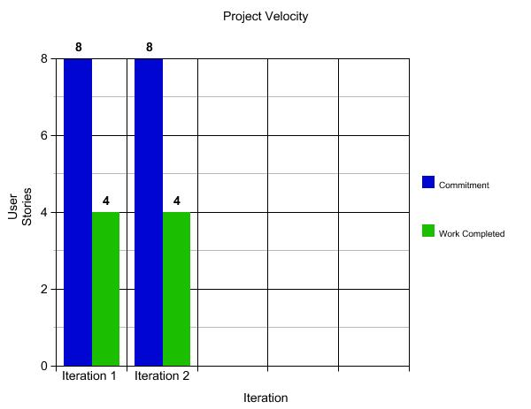

# Retrospective

## Unsuccessful Component

One of the parts of the project in the last iteration that was not as successful as we would’ve liked was the feature of allowing a user to manage a deck. This feature had 4 user stories associated with it: creating, deleting, viewing and editing a deck. This feature serves as the one of the key pillars of our application as it is absolutely necessary to allow users to manipulate their decks of flashcards.  In the previous iteration, we encountered issues resolving the exact details of how decks were going to be created and stored into a persistent database as opposed to our stub implementation. In the end, we were unable to successfully implement our persistent HSQLDB database by the end of the iteration. The problem of resolving these specific details added far too much development time to the implementation of the feature, which resulted in a significantly messier implementation than we would've liked to start with.  

## Plans to Improve

For this current iteration, we can improve the state of our Manage Deck feature by coming to a consensus on its implementation as early as possible in our development window. This will allow us to spend more time on the feature's actual implementation, and allot further time for testing to identify what does and doesn’t work during the coding process. We can also improve the feature by following the sample project in order to completely understand how a working persistent database can be implemented. By following these two plans for improvement we should be able to implement the Manage Deck feature successfully, which will give us a solid foundation for the rest of our features.

## Measuring success

 We can evaluate the success of this feature's implementation and improvement by completing thorough unit, integration, and acceptance tests that validate every aspect of this feature thoroughly. We can implement unit tests that ensure that a deck can be created, deleted, edit and viewed. Once these tests pass, we can work on integration tests that would ensure that the database is storing and retrieving the appropriate data. In addition, this would test if the HSQLDB is storing data persistently and functioning as expected. Lastly, we would implement an acceptance test that would the entire feature of managing a deck. This test would act as the user using the presentation layer to manipulate the other two layers and confirm that we got expected results. After these three levels of testing can be successfully passed, the problem we have had in implementing our Manage Deck feature can be deemed properly fixed. 
 
## Project Velocity

